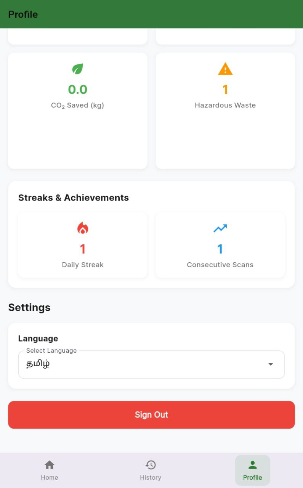
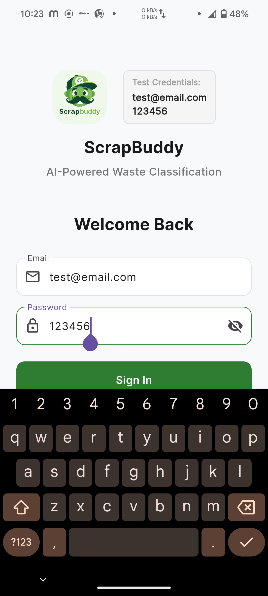
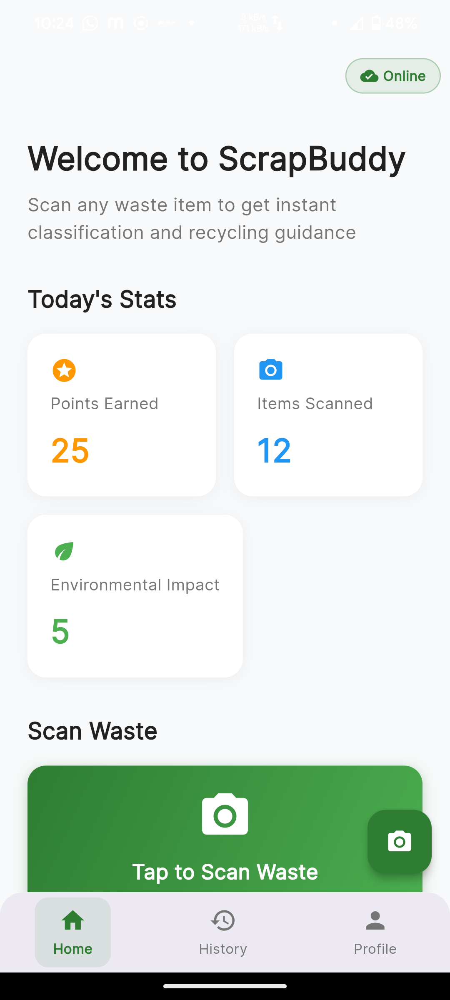
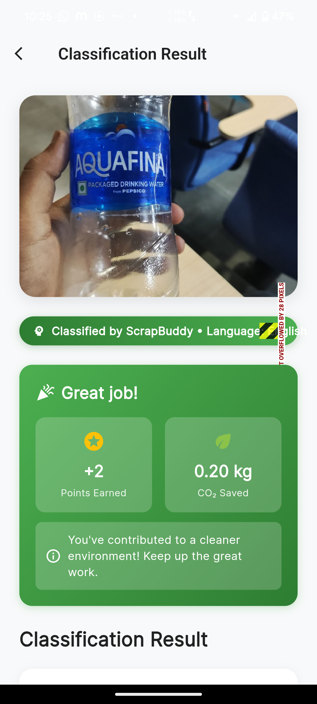
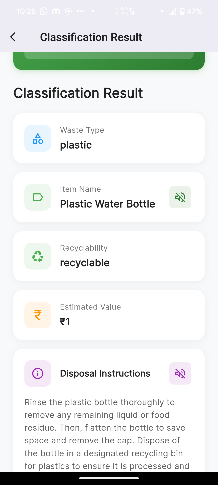

# ScrapBuddy - AI-Powered Waste Classification & Recycling Guide

An intelligent Flutter application that uses AI to classify waste materials and provide comprehensive recycling guidance. Built with Google's Vertex AI and Firebase, ScrapBuddy helps users make environmentally conscious decisions about waste disposal.

## 🌟 Innovative Features

### 🤖 AI-Powered Classification
- **Real-time waste classification** using Google's Vertex AI (Gemini 2.0 Flash)
- **Multi-language support** (English, Hindi, Tamil, Telugu, Bengali, Marathi, Gujarati, Kannada)
- **Offline fallback** with TensorFlow Lite model for when internet is unavailable
- **High accuracy** classification with confidence scores

### 🎯 Gamification & Tracking
- **Points system** for every successful classification
- **Daily streak tracking** to encourage consistent recycling habits
- **CO₂ impact calculation** showing environmental contribution
- **Achievement badges** for recycling milestones
- **Personal statistics** with detailed scan history

### 🔊 Voice Assistance
- **Text-to-speech** in local languages for accessibility
- **Audio guidance** for disposal instructions
- **Voice feedback** for classification results
- **Offline audio support** for key waste categories

### 📱 User Experience
- **Intuitive camera interface** with flash and focus controls
- **Gallery integration** for existing photos
- **Dark/light mode** support
- **Responsive design** for all screen sizes
- **Smooth animations** and modern UI

## 🛠️ Technology Stack

### Frontend
- **Flutter** - Cross-platform mobile development
- **Dart** - Programming language
- **Material Design 3** - Modern UI components
- **Shared Preferences** - Local data storage
- **Audio Players** - Audio feedback system

### Backend & AI
- **Google Vertex AI** - Gemini 2.0 Flash for waste classification
- **Firebase Authentication** - Secure user management
- **Cloud Firestore** - Real-time database with offline support
- **Firebase Storage** - Image and data storage
- **Sarvam AI** - Text-to-speech for Indian languages

### Machine Learning
- **TensorFlow Lite** - Offline classification model
- **Custom trained model** for 10+ waste categories
- **Real-time inference** on device

## 🚀 Getting Started

### Prerequisites
- Flutter SDK (3.19.0 or higher)
- Dart SDK (3.0.0 or higher)
- Android Studio / Xcode
- Firebase account
- Google Cloud account with Vertex AI enabled

### Installation Steps

1. **Clone the repository**
   ```bash
   git clone https://github.com/yourusername/scrapbuddy.git
   cd scrapbuddy
   ```

2. **Install dependencies**
   ```bash
   flutter pub get
   ```

3. **Setup Firebase**
   - Create a new Firebase project at [Firebase Console](https://console.firebase.google.com)
   - Add Android and iOS apps to your project
   - Download `google-services.json` (Android) and `GoogleService-Info.plist` (iOS)
   - Place them in the appropriate directories:
     - `android/app/google-services.json`
     - `ios/Runner/GoogleService-Info.plist`

4. **Configure API Keys**
   - Get your Vertex AI API key from Google Cloud Console
   - Get your Sarvam AI API key from [Sarvam AI](https://docs.sarvam.ai)
   - Create `android/app/src/main/res/values/secrets.xml`:
   ```xml
   <?xml version="1.0" encoding="utf-8"?>
   <resources>
       <string name="vertex_ai_api_key">YOUR_VERTEX_AI_KEY</string>
       <string name="sarvam_ai_api_key">YOUR_SARVAM_AI_KEY</string>
   </resources>
   ```

5. **Run the app**
   ```bash
   # For Android
   flutter run
   
   # For iOS
   flutter run --target=ios
   
   # For web
   flutter run -d chrome
   ```

### Building for Production

```bash
# Android APK
flutter build apk --release

# Android App Bundle
flutter build appbundle --release

# iOS
flutter build ios --release
```

## 📊 Supported Waste Categories

| Category | Examples | Recyclability |
|----------|----------|---------------|
| **Plastic** | Bottles, containers, bags | ♻️ Recyclable |
| **Paper** | Newspapers, cardboard, magazines | ♻️ Recyclable |
| **Metal** | Cans, foil, utensils | ♻️ Recyclable |
| **Glass** | Bottles, jars | ♻️ Recyclable |
| **Organic** | Food waste, garden waste | 🌱 Compostable |
| **E-Waste** | Batteries, electronics | ⚠️ Special disposal |
| **Hazardous** | Chemicals, bulbs | ⚠️ Special disposal |
| **Textiles** | Clothes, fabrics | ♻️ Donate/Reuse |

## 🌐 Language Support

| Language | Code | Status |
|----------|------|--------|
| English | en | ✅ Complete |
| Hindi | hi | ✅ Complete |
| Tamil | ta | ✅ Complete |
| Telugu | te | ✅ Complete |
| Bengali | bn | ✅ UI Ready |
| Marathi | mr | ✅ UI Ready |
| Gujarati | gu | ✅ UI Ready |
| Kannada | kn | ✅ UI Ready |

## 🔧 Development Features

### Code Architecture
- **Clean Architecture** with separation of concerns
- **Repository pattern** for data management
- **Service layer** for business logic
- **Provider pattern** for state management

### Testing
- **Unit tests** for core services
- **Widget tests** for UI components
- **Integration tests** for Firebase workflows

### Performance Optimizations
- **Image compression** before upload
- **Lazy loading** for history data
- **Offline caching** with Firestore
- **Efficient API calls** with retry logic

## 📱 Platform Support

| Platform | Status | Notes |
|----------|--------|-------|
| **Android** | ✅ Production Ready | API 26+ |
| **iOS** | ✅ Production Ready | iOS 12+ |
| **Web** | ✅ Beta | Full functionality |
| **Windows** | ✅ Beta | Desktop support |
| **macOS** | ✅ Beta | Desktop support |
| **Linux** | ✅ Beta | Desktop support |
<div align="center">      </div>

## 🤝 Contributing

We welcome contributions! Please see our [Contributing Guide](CONTRIBUTING.md) for details.

### Development Setup
1. Fork the repository
2. Create a feature branch
3. Make your changes
4. Add tests for new features
5. Submit a pull request

## 📄 License

This project is licensed under the MIT License - see the [LICENSE](LICENSE) file for details.

## 🙏 Acknowledgments

- **Google Vertex AI** for the powerful Gemini 2.0 model
- **Sarvam AI** for Indian language text-to-speech
- **TensorFlow Lite** for offline ML capabilities
- **Flutter team** for the excellent framework
- **Firebase team** for the robust backend services

## 📞 Support

For support, email support@scrapbuddy.app or join our [Discord community](https://discord.gg/scrapbuddy).

---

**Made with ❤️ for a cleaner planet**
